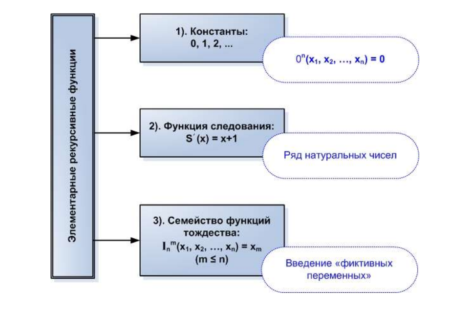

# Оглавление

1. [Понятие высказывания. Задача логики высказываний. Формулы логики высказываний. Интерпретации. Тавтологии и противоречия. Логическое следование и логическая эквивалентность в логике высказываний.](#1-понятие-высказывания-задача-логики-высказываний-формулы-логики-высказываний-интерпретации-тавтологии-и-противоречия-логическое-следование-и-логическая-эквивалентность-в-логике-высказываний)
2. [Исчисление высказываний методом таблиц истинности. Правила подстановки и замены в логике высказываний.](#2-исчисление-высказываний-методом-таблиц-истинности-правила-подстановки-и-замены-в-логике-высказываний)
3. [Понятие формальной теории. Введение (способ определения) формальной теории. Понятие логического вывода в исчислении высказываний. Свойства выводимости.](#3-понятие-формальной-теории-введение-способ-определения-формальной-теории-понятие-логического-вывода-в-исчислении-высказываний-свойства-выводимости)
4. [Непротиворечивость, разрешимость и полнота формальной теории.](#4-непротиворечивость-разрешимость-и-полнота-формальной-теории)
5. [Формальная аксиоматическая теория L исчисления высказываний. Полнота, непротиворечивость и разрешимость теории L. Независимость системы аксиом теории L.](#5-формальная-аксиоматическая-теория-l-исчисления-высказываний-полнота-непротиворечивость-и-разрешимость-теории-l-независимость-системы-аксиом-теории-l)
6. [Теорема дедукции в логике высказываний. Следствия из теоремы дедукции.](#6-теорема-дедукции-в-логике-высказываний-следствия-из-теоремы-дедукции)
7. [Понятие предиката. Местность, эквивалентность, тождественная истинность, выполнимость предиката. Кванторы. Квантификация. Формулы логики предикатов. Формулы замены кванторов.](#7-понятие-предиката-местность-эквивалентность-тождественная-истинность-выполнимость-предиката-кванторы-квантификация-формулы-логики-предикатов-формулы-замены-кванторов)
8. [Чистое исчисление предикатов первого порядка: формальная теория K. Свободное и связанное вхождение переменных. Понятие терма. Свободные термы.](#8-чистое-исчисление-предикатов-первого-порядка-формальная-теория-k-свободное-и-связанное-вхождение-переменных-понятие-терма-свободные-термы)
9. [Теорема о непротиворечивости чистого исчисления предикатов первого порядка.](#9-теорема-о-непротиворечивости-чистого-исчисления-предикатов-первого-порядка)
10. [Логическое следование и логическая эквивалентность в чистом исчислении предикатов первого порядка. Правила переименования свободных и связанных переменных.](#10-логическое-следование-и-логическая-эквивалентность-в-чистом-исчислении-предикатов-первого-порядка-правила-переименования-свободных-и-связанных-переменных)
11. [Канонические предварённые нормальные формы в логике предикатов первого порядка. Леммы о получении канонических ПНФ.](#11-канонические-предварённые-нормальные-формы-в-логике-предикатов-первого-порядка-леммы-о-получении-канонических-пнф)
12. [Этапы получения предварённых нормальных форм в прикладных исчислениях предикатов первого порядка. Привести пример.](#12-этапы-получения-предварённых-нормальных-форм-в-прикладных-исчислениях-предикатов-первого-порядка-привести-пример)
13. [Сколемовская и клаузальная формы в прикладных исчислениях предикатов первого порядка. Теорема о невыполнимости множества дизъюнктов.](#13-сколемовская-и-клаузальная-формы-в-прикладных-исчислениях-предикатов-первого-порядка-теорема-о-невыполнимости-множества-дизъюнктов)
14. [Правило резолюции и метод резолюций в логике высказываний. Стратегии метода резолюций.](#14-правило-резолюции-и-метод-резолюций-в-логике-высказываний-стратегии-метода-резолюций)
15. [Унификация в логике предикатов первого порядка. Универсум Эрбрана. Понятие унификатора.](#15-унификация-в-логике-предикатов-первого-порядка-универсум-эрбрана-понятие-унификатора)
16. [Правило резолюции и метод резолюций в логике предикатов первого порядка.](#16-правило-резолюции-и-метод-резолюций-в-логике-предикатов-первого-порядка)
17. [Теоремы Гёделя о неполноте формальных систем.](#17-теоремы-гёделя-о-неполноте-формальных-систем)
18. [Нечеткие множества. Нечеткая логика. Высказывания в нечеткой логике. Нечеткие логические операции, оценки степени истинности.](#18-нечеткие-множества-нечеткая-логика-высказывания-в-нечеткой-логике-нечеткие-логические-операции-оценки-степени-истинности)
19. [Обобщенные нечеткие логические операции: t-норма, k-норма, нечеткая импликация. Оценки степени истинности высказываний с обобщенными нечеткими логическими операциями.](#19-обобщенные-нечеткие-логические-операции-t-норма-k-норма-нечеткая-импликация-оценки-степени-истинности-высказываний-с-обобщенными-нечеткими-логическими-операциями)
20. [Нечеткая лингвистическая логика. Лингвистическая переменная.](#20-нечеткая-лингвистическая-логика-лингвистическая-переменная)
21. [Нечеткий логический вывод. Фаззификация, агрегация, дефаззификация (привести пример).](#21-нечеткий-логический-вывод-фаззификация-агрегация-дефаззификация-привести-пример)
22. [Модальные логики. Операторы необходимости и возможности. Отношения модальности в алетической логике. Модель Крипке.](#22-модальные-логики-операторы-необходимости-и-возможности-отношения-модальности-в-алетической-логике-модель-крипке)
23. [Темпоральные логики: линейная и древовидная модели. Темпоральные операторы. Особенности логик CTL*, CTL, LTL.](#23-темпоральные-логики-линейная-и-древовидная-модели-темпоральные-операторы-особенности-логик-ctl-ctl-ltl)
24. [Понятие алгоритма. Основные требования и общие свойства алгоритмов. Универсальные алгоритмические модели.](#24-понятие-алгоритма-основные-требования-и-общие-свойства-алгоритмов-универсальные-алгоритмические-модели)
25. [Рекурсивные функции. Частичная рекурсивность. Тезис Чёрча.](#25-рекурсивные-функции-частичная-рекурсивность-тезис-чёрча)
26. [Машина Тьюринга (ТМ): назначение, устройство, детерминированность. Команды и программа ТМ. Численная ТМ. Применимость и конфигурация машины Тьюринга.](#26-машина-тьюринга-тм-назначение-устройство-детерминированность-команды-и-программа-тм-численная-тм-применимость-и-конфигурация-машины-тьюринга)
27. [Тьюрингово вычисление. Функция, вычислимая по Тьюрингу. Композиция машин Тьюринга. Универсальная машина Тьюринга.](#27-тьюрингово-вычисление-функция-вычислимая-по-тьюрингу-композиция-машин-тьюринга-универсальная-машина-тьюринга)
28. [Тезис Тьюринга. Проблема остановки машины Тьюринга.](#28-тезис-тьюринга-проблема-остановки-машины-тьюринга)
29. [Нормальные алгоритмы Маркова (НАМ). Марковские подстановки. Правила применения НАМ к словам в заданном алфавите.](#29-нормальные-алгоритмы-маркова-нам-марковские-подстановки-правила-применения-нам-к-словам-в-заданном-алфавите)
30. [Нормально вычислимые функции. Принцип нормализации Маркова.](#30-нормально-вычислимые-функции-принцип-нормализации-маркова)
31. [Эквивалентность и взаимная сводимость базовых алгоритмических моделей: машин Тьюринга, частично-рекурсивных функций и нормальных алгоритмов Маркова.](#31-эквивалентность-и-взаимная-сводимость-базовых-алгоритмических-моделей-машин-тьюринга-частично-рекурсивных-функций-и-нормальных-алгоритмов-маркова)
32. [Вычислимость и разрешимость. Алгоритмически неразрешимые проблемы. Теорема Райса и ее прикладное значение.](#32-вычислимость-и-разрешимость-алгоритмически-неразрешимые-проблемы-теорема-райса-и-её-прикладное-значение)
33. [Вычислительная сложность алгоритма. Асимптотические оценки функции сложности.](#33-вычислительная-сложность-алгоритма-асимптотические-оценки-функции-сложности)
34. [Трудноразрешимые задачи. Классы задач в теории вычислительной сложности.](#34-трудноразрешимые-задачи-классы-задач-в-теории-вычислительной-сложности)
35. [Недетерминированная машина Тьюринга. Класс NP. Полиномиальная сводимость. NPполные задачи.](#35-недетерминированная-машина-тьюринга-класс-np-полиномиальная-сводимость-npполные-задачи)

---

## 1. Понятие высказывания. Задача логики высказываний. Формулы логики высказываний. Интерпретации. Тавтологии и противоречия. Логическое следование и логическая эквивалентность в логике высказываний.

**Простое высказывание** – повествовательное предложение, состоящее из подлежащего и сказуемого.

*Составные высказывания* образуются из простых с помощью логических связок. Таким образом, в простом высказывании не должно быть логических связок.

**Формулой логики высказываний** называется конструкция, состоящая из пропозициональных переменных (букв, обозначающих простые высказывания), логических связок и скобок.

**Исчисление высказываний** занимается установлением факта истинности или ложности формул логики высказываний, в зависимости от интерпретации.

Пусть $F(x_1,..,x_n)$ – формула логики высказываний, $x_1,..,x_n$ – простые высказывания. Конкретный набор истинностных значений переменных $x_1,..,x_n$ называется **интерпретацией** $I_k$ формулы $F$.

Формула, истинностная в некоторой интерпретации, называется **выполнимой**:
$\exists I_k: F(I_k )=T$

Формула, истинностная во всех возможных интерпретациях, называется **общезначимой** (или тавтологией).

Формула, ложная во всех возможных интерпретациях, называется **невыполнимой** (или противоречием).

Пусть $P$ и $Q$ две формулы. Говорят, что $Q$ логически следует из $P$: $P \Rightarrow Q$, если во всех интерпретациях, в которых истинна $P$, $Q$ также истинна. Говорят, что $P$ и $Q$ логически эквивалентны, если являются следствием друг друга: $(P\Rightarrow Q)\wedge(Q\Rightarrow P),\ Q\Leftrightarrow P$

## 2. Исчисление высказываний методом таблиц истинности. Правила подстановки и замены в логике высказываний.

<!-- TODO Исчисление высказываний методом таблиц истинности -->

Пусть дана $F$ в которую входит $X: F(...X...)$, и $P$ – тоже формула. Тогда запись $F(...X...)\  \{P//X\}$ обозначают формулу, полученную из $F$ **подстановкой** $P$ вместо всех вхождений $X$ в формулу $F$, а $F(...X...)\ \{P/X\}$ – **заменой** некоторого вхождения $X$ на формулу $P$.

*Теорема (правило подстановки)*

Если формула $F(...X...)$ тавтология и $P$ – любая формула, о выполнимости которой неизвестно, то подстановка $P$ вместо $X$ порождает тавтологию.

*Теорема (правило замены)*

Пусть в формулу $F$ входит подформула $Q$. Если формула $Q \Leftrightarrow S$, то замена некоторого вождения $Q$ на $S$ дает формулу, логически эквивалентную $F$:

$$F(...Q...)\ \{S/Q\} \Leftrightarrow F$$

## 3. Понятие формальной теории. Введение (способ определения) формальной теории. Понятие логического вывода в исчислении высказываний. Свойства выводимости.

**Понятие формальной теории** - было разработано для формализации логики и теории доказательств.

Формальная теория $\Tau$ определена, если выполняются $4$ условия:
1.	Задано $\Alpha$ – множество символов теории $\Tau$ (алфавит),
2.	Задано $\Phi$ - множество слов теории $\Tau$ (формулы),
3.  Задано $\Beta\subset\Phi$ - аксиомы теории $\Tau$: если $\Beta\neq\empty$, то $\Tau$ - аксиоматическая,
4.  Задано конечное множество $\{R_1,..,R_k\}$ - множество отношений между формулами теории $\Tau$ (правила вывода).

Пусть $A_1,A_2,..,G$ - формулы теории $\Tau$, $\{A_1,..,A_n,G\} \subset \Phi$. Если $\exists$ правило вывода $R$, такое, что все $n+1$ формула находятся в отношении $R:\ A_1,..,A_n,G | R$, то говорят что $G$ - **непосредственно выводима** из формул $A_1,..,A_n$ по правилу $R$.

При этом, формулы $A_1,..,A_n$ называются **посылками вывода**, $G$ - **заключением** и записывают:

$$\frac{A_1,..,A_n}{G}R$$

**Логическим выводом** формулы $G$ из формул $A_1,..,A_n$ в теории $\Tau$ называют последовательность формул $E_1,..,E_m$, причем
1. $E_m = G$
2. $\forall E_i, 1 \leq i < m$, верно одно из перечисленного:

    - $E_i \in \Beta$ - аксиома,
    - $E_i \in \{A_1,..,A_n\}$ - посылка вывода,
    - $E_i$ получена выводом из предыдущих формул $\frac{E_p,..,E_q}{E_i}R,\ p<q<i$

*Свойства выводимости:*

1.  *"Добавление гипотез не нарушает выводимость"*

    Есть два множества формул $\Gamma$ и $\Delta$: $\Gamma\subset\Delta$. Если формула $A$ выводима из $\Gamma$, то $A$ выводима из $\Delta$. 
2.  Пусть некоторая формула $A$ выводима из $\Delta$ в теории $\Tau$. Если для $\forall B_i \in \Delta: \ \Gamma\vdash B_i$, то $\Gamma \vdash A$.

## 4. Непротиворечивость, разрешимость и полнота формальной теории.

Формальная теория $\Tau$ называется **семантически непротиворечивой**, если никакая формула теории $\Tau$ не является
противоречием.

Формальная теория $\Tau$ называется **формально непротиворечивой**, если в процессе построения логического вывода формулы $G$ невозможна одновременная выводимость формул $G$ и $\neg G$.

*Теорема*

Теория $\Tau$ семантически непротиворечива ТИТТ, когда она формально непротиворечива.

Все формальные теории делятся на *разрешимые* и *полуразрешимые*:

Формальная теория $\tau$ называется **разрешимой**, если существует алгоритм, позволяющий для произвольной формулы $G$ определить, является ли $G$ теоремой теории $\tau$ или нет.

Формальная теория $\tau$ называется **полуразрешимой**, если существует алгоритм, который для произвольной формулы $G$ дает ответ "да", если $G$ - теорема теории $\tau$, и не дает никакого ответа в противном случае.

*Теорема о полноте*

Формула $G$ является теоремой теории $\tau$ ТИТТ, когда $G$ - тавтология.

## 5. Формальная аксиоматическая теория L исчисления высказываний. Полнота, непротиворечивость и разрешимость теории L. Независимость системы аксиом теории L.

Теория $L$, как и любая формальная теория, определяется:
1. Алфавитом $A$ - включает пропозициональные символы, символы логических операций и технические символы;
2. Множеством слов $\Phi$:
    
    - $A, B, C, ..$
    - $\neg A, \neg B , A \to B, ...$
    - ...

3. Множеством аксиом $B \subset \Phi$. В теории $L$ следующие аксиомы:

    - $A_1:\ A \to (B \to A)$
    - $A_2:\ (A\to (B\to C)) \to ((A \to B) \to (A \to C))$
    - $A_3:\ (\neg B \to \neg A) \to ((\neg B \to A) \to B)$

4. Множеством правил вывода $R$. В теории $L$ одно правило вывода:
    $$\frac{A\ A\to B}{B} MP - \text{Modus Ponens}$$

**Полнота:**

*Теорема о полноте*

Формула $G$ является теоремой теории $\tau$ ТИТТ, когда $G$ - тавтология.

**Непротиворечивость:**

Теория $L$ является семантически непротиворечивой.

Теория $L$ формално непротиворечива, так как невозможно указать такую формулу $G$, чтобы она и ее отрицание были одновременно выводимы в теории $L$.

**Разрешимость:**

Теория $L$ является разрешимой, так как по теореме о полноте, любая формула теории $L$ является теоремой ТИТТ, когда она тавтология, то есть доказуемость произвольной формулы $G$ можно проверить с помощью таблиц истинности.

**Независимость системы аксиом:**

Аксиома $A_i \in B$ называется **независимой** от остальных аксиом данной теории, если она не выводима из множества аксиом $B \backslash \{A_i \}$.

Если все аксиомы теории независимы, то система этих аксиом является независимой.  

Если система аксиом независима, то ни одна аксиома не может быть выведена из остальных аксиом теории.

Система аксиом теории $L$ является независимой.

## 6. Теорема дедукции в логике высказываний. Следствия из теоремы дедукции.

*Теорема дедукции*

Пусть $\Gamma$ - множество гипотез, $A$ и $B$ - формулы и $\Gamma , A \vdash_{L}B$. Тогда верно, что $\Gamma  \vdash_{L}A\to B$

*Следствия*

1. $\Gamma = \empty: A \vdash_{L} B \Rightarrow \ \vdash_{L}A\to B $
2. Правило транзитивности: $A \to B, B \to C \vdash_{L} A \to C$
3. Правило сечения: $A \to (B \to C), B \vdash_{L} A \to C$

## 7. Понятие предиката. Местность, эквивалентность, тождественная истинность, выполнимость предиката. Кванторы. Квантификация. Формулы логики предикатов. Формулы замены кванторов.

Выражения, имеющие вид повествовательного предложения и содержащие неопределенные термины (аргументы), называются **предикатами**.

При замене аргументов на конкретные значения из области определения предикатов, получается высказывание, которое истинно или ложно.

$P(x): \text{"x является человеком"}$

$x \in M = \{\text{Вася}, ..\}$

$n$-**местным предикатом** $P(x_1,...,x_n)$ на множестве $M$ называют функцию от $n$ аргументов $x_1,...,x_n$, областью определения которой является
$M$, а областью значений — множество $\{T,F\}$.

Два предиката на множестве $M$ называются **эквивалентными**, если они принимают одинаковые значения на одинаковых наборах аргументов.

Предикат $P$ называется **тождественно истинным** на множестве $M$, если во всех интерпретациях аргументов он принимает значение "истинно".

Предикат $P$ называется **тождественно ложным** на множестве $M$, если во всех интерпретациях аргументов он принимает значение "ложно".

Предикат $P$ называется **выполнимым** на множестве $M$, если множество его значений включает как "истинно", так и "ложно".

Пусть $P(x)$ - одноместный предикат на $M$.

Символикой $\forall x P(x)$ обозначим формулу, которая принимает значение "истинно" для всякого $X$ из множества $M$.

Символикой $\exists x P(x)$ обозначим формулу, которая принимает значение "истинно", если в множестве $M$ существует хотя бы один элемент $a \in M$, такой, что $P(a) = \text{"истинно"}$.

**Квантификция** - процесс введения кванторов.

Формула, полученная из символических записей предикатов, соединенных логическими связками с применением операции квантификации, называется **формулой логики предикатов**.

*Формулы замены кванторов:*

$$\neg\forall x P(x) \Leftrightarrow \exists x \neg P(x)$$
$$\neg\exists x P(x) \Leftrightarrow \forall x \neg P(x)$$

## 8. Чистое исчисление предикатов первого порядка: формальная теория K. Свободное и связанное вхождение переменных. Понятие терма. Свободные термы.

Построение логического вывода формул логики предикатов называется **исчислением предикатов**.

Как и любая формальная теория, теория $K$ считается заданной, если заданы:
1. $A$ - алфавит теории $K$, включающий: предикатные символы (A, B, ..), переменные (x, y, z, ...),
константы (a, b, c, ...), функциональные символы (f, g, h, ...), логические связки ($\neg, \to$), скобки (любые) и кванторы ($\exists, \forall$);

2. $\Phi$ - множество формул теории $K$;

3. $B \cup \Phi$ - аксиомы теории $K$ (аксиомы теории $L$ + две предикатные аксиомы):

    - $\forall x A(x) \to A(t)$, если терм $T$ свободен для подстановки вместо $x$ в формуле $A$;
    - $A(t) \to \exists x A(x).$

4. $R$ - множество правил вывода:

    - Modus Ponens (MP): $\frac{A\ A \to B}{B}$;
    - Правило обобщения ($\forall$-введения): $\frac{B \to A(x)}{B \to \forall x A(x)}$ при условии, что $x$ не входит свободно в $B$.
    - Правило $\exists$-введения: $\frac{A(x) \to B}{\exists x A(x) \to B}$ при условии, что $x$ не входит свободно в $B$.

Исчисление предикатов (ИП) в теории $K$ без собственных аксиом называется **чистым**.

Переменная $x$ входит **свободно** в формулу $A$, если она не находится в области действия квантора по переменной $x$. Если переменная $x$ входит в формулу под действием квантора, то такое вхождение называется **связанным**.

**Терм** - выражение, имеющее значение.

Терм $t$ называется **свободным** для переменной $x$ в формуле $A$, если ни одно свободное вхождение $x$ в $A$ не попадает в область действия квантора по переменной, входящей в терм $t$.

## 9. Теорема о непротиворечивости чистого исчисления предикатов первого порядка.

Пусть $F \in \Phi |_\text{т.K}$ и h(F) - оператор преобразования формулы $F$ в формулу теории $L$. То есть оператор $h$ удаляет из формулы все кванторы и термы, оставляя только предикатные символы и логические связки, причем предикатные символы рассматриваются как простые высказывания.

Говорят что применение оператора $h$ к формуле $F$ позволяет получить ее структуру.

Очевидны следующие свойства оператора $h$: $h(\neg A) = \neg h(A),\ h(A\to B) = h(A) \to h(B)$

*Теорема*

Формальная теория $K$ непротиворечива семантически и формально.

*Доказательство*

1. Рассматрим все аксиомы:

Т.к. $A_1, A_2, A_3$ - аксиомы в теории $L$, то по определению оператора $h$:

$$h(A_1)=A_1,...$$

$$h(A_4) = h(\forall x A(x) \to A(t)) = A \to A$$
$$h(A_5) = h(A(t)\to \exists x A(x)) = A \to A$$

Т.о., структуры всех аксиом теории $K$ - тавтологии.

2. Правила вывода:

    - MP сохраняет тавтологичность структуры: если $h(A)$ - тавтология и $h(a \to B)$ - тавтология, то $h(B)$ - тавтология.

    - Правило обобщения ($\forall$-введения) $\frac{B \to A(x)}{B \to \forall x A(x)}$:  
    $h(B \to A(x)) = B \to A \\ h(B \to \forall A(x)) = B \to A$

    - Правило $\exists$-введения $\frac{A(x) \to B}{\exists x A(x) \to B}$:

        $h(A(x) \to B) = A \to B \\ h(\exists x A(x) \to B) = A \to B$

Структуры заключений совпадают со структурами посылок, следовательно правлиа выше сохраняют тавтологичность структуры.

3. Итог:

Если $A$ является выводимой в теории $K$, то $h(A)$ - тавтология, значит теория $K$ семантически непротиворечива. 

Предположим что $A$ и $\neg A$ одновременно выводимы в теории $K$, тогда $h(A)$ - тавтология и $h(\neg A)$ - тавтология, что невозможно, а значит теория $K$ формально непротиворечива.

## 10. Логическое следование и логическая эквивалентность в чистом исчислении предикатов первого порядка. Правила переименования свободных и связанных переменных.

Формула $B$ в теории $K$ является **логическим следствием** формулы $A$ в теории $K$, если $B$ выполнима на любом наборе значений переменных в любой интерпретации, на которой истинна $A$

Формулы $A$ и $B$ в теории $K$ называются логически эквивалентными, если они являются логическим следствием друг друга.

*Правила переименования свободных и связанных переменных*

1. Если формула $A(x)$ выводима в теории $K$ и содержит свободные вхождения переменной $x$, ни одно из которых не находится в области действия квантора по $Y$, то выводима формула $A(y)$:

$$\vdash_K A(X) \Rightarrow \vdash_K A(y)$$

*Доказательство*:

2. Если в теории $K$ выводимы формулы $\forall x A(x)$ или $\exists x A(x)$, при условии, что $A(x)$ не содержит свободных вхождений $y$ и содержит свободные вхождения $x$, ни одно из которых не входит в область определения квантора по $y$, то выводимы формулы $\forall y A(y)$ и $\exists y A(y)$ соответственно.

*Доказательство*:

## 11. Канонические предварённые нормальные формы в логике предикатов первого порядка. Леммы о получении канонических ПНФ.

Формула вида $Q_1x_1...Q_nx_nF$, где $Q_1,..,Q_n \in \{\forall, \exists\}$, $x_i$ - переменная, $F$ - формула без кванторов, - называется **предваренной нормальной формой** (ПНФ) или формулой в ПНФ.

$Q_1x_1...Q_nx_n$ называется **префиксом** ПНФ, $F$ - **матрицей** ПНФ.

*Лемма*

В исчислении предикатов первого порядка, для каждой формулы существует логически эквивалентная ей формула в ПНФ.

## 12. Этапы получения предварённых нормальных форм в прикладных исчислениях предикатов первого порядка. Привести пример.

1. Исключение импликаций:

$$A \to B \Leftrightarrow \neg A \vee B \Leftrightarrow \neg (A \wedge \neg B)
$$

2. Переименовать (если необходимо) связанные переменные, так чтобы никакая переменная не входила в формулу и связанно и свободно.

$$A(x) \vee \neg B(y) \wedge \exists y C(x, y)$$
$$A(x) \vee \neg B(y) \wedge \exists z C(x, z) \ \{z / y\}$$

3. Разделить при необходимости связанные переменные. Достигается отсутствием случайно совпадающих связанных переменных.

$$\forall x [B(y) \wedge (\neg C(x) \vee \exists x A(y, x))]$$
$$\forall x [B(y) \wedge (\neg C(x) \vee \exists v A(y, v))]\ \{v / x \}$$

4. Удаление (элиминация) лишних кванторов - в области действия которых нет квантифицированных переменных:

$$\cancel{\forall w} [B(y) \wedge (\neg C(x) \vee \exists x A(y, x))]$$

5. Протаскивание отрицаний - сужаем область ействия отрицаний, убираем кратные отрицания. Отрицания остаются только у предикатов.

6. Смещение кванторов влево: образование префикса и матрицы.

$$\forall x A \wedge \forall x B \Leftrightarrow \forall x (A \wedge B)$$
$$\forall x A \wedge B \Leftrightarrow \forall x (A \wedge B),\ \text{B не содержит x}$$
$$A \wedge\forall x  B \Leftrightarrow \forall x (A \wedge B),\ \text{A не содержит x}$$
$$\exists x A \wedge B \Leftrightarrow \exists x (A \wedge B),\ \text{B не содержит x}$$
$$A \wedge\exists x  B \Leftrightarrow \exists x (A \wedge B),\ \text{A не содержит x}$$

## 13. Сколемовская и клаузальная формы в прикладных исчислениях предикатов первого порядка. Теорема о невыполнимости множества дизъюнктов.

Пусть есть замкнутая формула $\exists y P(y)$, тогда в области определения можно указать предметную константу $c \in M$, такую что $P(c) = True$.

Пусть $P$ содержит $x$ и $y$, тогда замкнутая формула $\forall x \exists y P(x,y)$ выполнима ТИТТ, когда выполнима $\forall x P(x, f(x))$, где $f$ - терм.

**Форма Сколема** (Сколемовской формой) называют ПНФ, не содержащей кванторов существования, полученной в результате применения правил Сколема:
1. если $\exists$ стоит в начале префикса, то он элиминируется, а вместо подкванторной переменной вводятся константы;
1. если $\exists$ стоит в середине или конце префикса, то он элиминируется и вместо него вводится функциональный символ (терм), местность которого равна количеству предшествующих кванторов $\forall$, а аргументами - подкванторные переменные этих кванторов.

**Клаузальной** называется Сколемовская форма, матрица которой представлена в КНФ.

*Теорема*

Если $\Gamma$ - множество дизъюнктов, полученное из исходной формулы логики предикатов $F$, то $F$ является противоречием ТИТТ, когда множество $\Gamma$ - невыполнимо.

Невыполнимость $\Gamma$ означает, что не существуют интерпретации для всех переменных, входящих как аргументы в дизъюнкты $\Gamma$, в которой все дизъюнкты приняли бы значение $True$.

## 14. Правило резолюции и метод резолюций в логике высказываний. Стратегии метода резолюций.

Пусть $C_1$, $C_2$ - состоавные высказывания, имеющие вид дизъюнктов:

$$C_1 = A \vee P\\ C_2 = B \vee \neg P$$

$A$ и $B$ - составные высказывания, $P$ - простое высказывание. **Правилом резолюции** является следующее правило вывода:

$$\frac{C_1, C_2}{A\vee B} Res$$

$C_1,C_2$ - родительские дизъюнкты (резольвируемые формулы),
$A\vee B$ - резольвента,
$P, \neg P$ - контрарные литералы.

*Замечание*

1. Пусть $A$ отсутствует либо ложно. Тогда:

$$\frac{C_1, C_2}{A\vee B} Res = \frac{P, B \vee \neg P}{B} = \frac{P, B \to P}{B} MP$$

2. Если отсутствуют $A$ и $B$, то говорят, что правило порождает пустую формулу, которая называется пустымы дизъюнктом:

$$\frac{P,\neg P}{\square}Res$$

*Теорема*

Резольвента является логическим следствием резольвируемых дизъюнктов.

**Метод резолюций**

Формируется множество $\Gamma = \{F_1,..,F_n,G\}$, причем каждый элемент множества приведен к дизъюнкту (представлен в дизъюнктивной форме). К дизъюнктам множества $\Gamma$ применяют правило резолюции и каждый раз резольвенту добавляют в $\Gamma$. После чего резольвента имеет право участвовать в резольвировании наравне с остальными формулами множества $\Gamma$:

1. $\Gamma = \{F_1, F_2\}, F_1 = A\vee P, F_2 = B\vee \neg P$
2. $F_3 = A\vee B\ (F_1,F_2, Res),\ \Gamma = \Gamma \cup \{F_3\}$

3. В ходе выполнения резольвирования в п.2 возможны следующие варианты:
    - Среди дизъюнктов множества $\Gamma$ **нет резольвируемых**. Т.о., существует интерпретация, в которой все формулы $\Gamma$ истинны, $\Rightarrow G$ не является тождеством, тогда $(F_1,..,F_n)\cancel{\Rightarrow}G$ и говорят, что $\Gamma$ - выполнимо, теорема опровергнута;
    - Результатом очередного применения правила резолюции является пустой дизъюнкт $\square$. Т.о., не существует такой интерпретации, в которой все формулы $\Gamma$ - истинны, т.е.
    $F_1\wedge F_2\wedge...\wedge F_n \wedge \neg G= False$. Тогда $(F_1,..,F_n)\Rightarrow G$ - теорема доказана, $\Gamma$ - не выполнимо;
    - не наблюдается ни один из выше названных случаев. Процесс резольвирования не заканчивается, а множество $\Gamma$ пополняется все новыми резольвентами. Алгоритм не дает никакого ответа о логическом следовании $G$ из $(F_1,..,F_n)$.

**Стратегии резольвирования:**

1. Насыщение уровня
- $\Gamma_1 = Res(\Gamma)$
- $\Gamma_2 = Res(\Gamma_1)$
- ..
- $\Gamma_n = Res(\Gamma_{n-1})$

2. Линейная - каждая резольвента, полученная в $k$-м шаге, берется в качестве одного из родительских дизъюнктов на $(k+1)$-м шаге. 

3. Перебор дизъюнктов для резолюции осуществляется в порядке увеличения их длины, так чтобы сначала использовались более короткие дизъюнкты и процесс резолюций образовывал последовательность, удобную для анализа.

## 15. Унификация в логике предикатов первого порядка. Универсум Эрбрана. Понятие унификатора.

Суть **унификации** - в замене некоторых переменных на константу или терм, с тем чтобы было возможно получение контрарных литералов и чтобы в последствии было возможно резольвирование, которое до унификации было невозможным.

**Универсум Эрбрана**

Множество $H(\Gamma)$ определяется рекурсивно следующим образом:
1. Множество всех констант, имеющихся в формулах множества $\Gamma$, включаются в $H(\Gamma)$. Если в $\Gamma$ нет констант, то в $H(\Gamma)$ принудительно вводится константа;
2. Если термы $t_1,..,t_m$ входят в формулы множества $\Gamma$, то $H(\Gamma)$ содержит терм $f(t_1,..,t_m)$, где $f$ - любой $m$-местный функциональный символ из $\Gamma$;
3. Никаких других термов в $H(\Gamma)$ нет.

$H(\Gamma)$ является наиболее общей областью интерпретаций формул из $\Gamma$, поэтому поиск моделей $\Gamma$ можно ограничить Эрбрановскими интерпретациями. Оные образуются при присвоении произвольным образом значений $true/false$ атомарным формулам, содержащимся в $\Gamma$. Если модель $\Gamma$ существует, то именно среди оных (Эрбрановских интерпретаций), а иначе ее не существует вообще.

$H(\Gamma)$ - бесконечное счетное множество.

При унификации должны выполняться следующие условия:

1. Терм $t_i$ не может быть переменной;
2. Запрещается циклическая замена.

Унификатором формул $F_1, F_2$ называется такое множество подстановок $\lambda = \{t_1 //x,..\}$ в формуле $F_1, F_2$, на котором $F_1$ и $F_2$ становятся тождественными (т.е. унифицируются).

В общем случае для формулы может существовать несколько унификаторов, но среди них всегда найдется наиболее общий (обозначается $\sigma$), из которых следуют все остальные.

## 16. Правило резолюции и метод резолюций в логике предикатов первого порядка.

*Правило резолюций*

Пусть $C_1$ и $C_2$ - две формулы логики предикатов первого порядка, тогда правило вывода

$$\frac{C_1,\ C_2}{(A \vee B)\sigma} Res - \text{правило резолюции в логике предикатов.}$$

Если в $C_1$, $C_2$ существуют контрарные литералы $P_1$, $P_2$, которые представляют собой формулы, становящиеся тождественными при унификации наиболее общим унификатором $\sigma$.

$$C_1 = A \vee P_1,\ C_2 = B \vee \neg P_2$$

$$\lambda = \{a//x\}$$

$$P_1 = Q(x),\ P_2 = Q(a), a = const$$

$$(A \vee B) \lambda\ C_1 = A \vee Q(a),\ C_2=B \vee \neg Q(a)$$

Метод резолюций в логике предикатов аналогичен методу резолюций в логике высказываний и применяется к множеству дизъюнктов

$$\Gamma = \{F_1,F_2,..,F_n, \neg G\}$$

В результате получаем один из трех возможных случаев:

Дописать

## 17. Теоремы Гёделя о неполноте формальных систем.

*Первая теорема Гёделя о неполноте*
Теорема утверждает, что в произвольной непротиворечивой аксиоматической теории с доказуемыми арифметическими высказываниями может быть построено истинное арифметическое высказывание, истинность которого не доказуема средствами самой теории. Иначе говоря, всякая эффективная аксиоматическая теория, достаточная для представления формальной арифметики, не может одновременно обладать свойствами непротиворечивости и полноты. 

Теория обладает бесконечным множеством формул, часть из которых (аксиомы) принимаются как истинные без доказательства, а остальные (теоремы) доказываются в рамках теории как истинные путем построения логического вывода.

*Вторая теорема Гёделя о неполноте*

Любая эффективная рекурсивно аксиоматизируемая формальная теория T, включающая формальную арифметику и некоторые высказывания о формальной доказуемости, содержит утверждение о своей непротиворечивости тогда и только тогда, когда теория T противоречива.

*см файл на сайте кафедры чтобы разобраться. Там представлены обобщенные (укороченные) формулировки теорем, я привел исходные - более сложные, потому что топлю за мазохизм*

## 18. Нечеткие множества. Нечеткая логика. Высказывания в нечеткой логике. Нечеткие логические операции, оценки степени истинности.

**Нечетким множеством** $\widetilde{A}$ на универсуме $U$ называется множество упорядоченных пар $\{(x, \mu_{\widetilde{A}} (x)): x \in U\}$. Каждому элементу $x \in U$ сопоставляется значение функции принадлежности к множеству $\widetilde A$.

$$\mu_{\widetilde{A}} (x) = \begin{cases} 
1 - \text{x точно принадлежит множеству}\\
0 - \text{x точно не принадлежит множеству}\\ 
y, y\in(0;1) - \text{x - нечеткий элемент}
\end{cases}$$

**Нечеткая логика** оперирует предложениями, в отношении которых можно дать заключение о степени их истинности или ложности. Степерь истинности (ложности) выражается числом из отрезка $[0;1]$, где крайние значения, а именно: 0 - означает что предложение точно ложно, 1 - означает что предложение точно истинно.

Для всякого предложения нечеткой логики необходимо задать базовое множество $U$ и нечеткое множество на нем, и при этом функция принадлежности будет отображать предложения в нечеткое множество, а точнее в упорядоченное множество пар: значение элемента - значение функции принадлежности для него.

Высказыванием нечеткой логики называют предложение вида "x есть $\widetilde A$", где $x\in U,\ \widetilde A$ -нечеткое множество на $U$.

*Операции:*

1. $\mu_{\neg \widetilde A}(x)=1-\mu_{\widetilde A}(x)$
2. $\mu_{\widetilde A \vee \widetilde B}(x)=\max [\mu_{\widetilde A}(x), \mu_{\widetilde B}(x)]$
2. $\mu_{\widetilde A \wedge \widetilde B}(x)=\min [\mu_{\widetilde A}(x), \mu_{\widetilde B}(x)]$
2. $\mu_{\widetilde A \to \widetilde B}(x)=\max [1-\mu_{\widetilde A}(x), \mu_{\widetilde B}(x)]$
2. $\mu_{\widetilde A \vee \neg\widetilde A}(x)=\max [\mu_{\widetilde A}(x), 1-\mu_{\widetilde A}(x)]$
2. $\mu_{\widetilde A \wedge \neg\widetilde A}(x)=\min [\mu_{\widetilde A}(x), 1-\mu_{\widetilde A}(x)]$

## 19. Обобщенные нечеткие логические операции: t-норма, k-норма, нечеткая импликация. Оценки степени истинности высказываний с обобщенными нечеткими логическими операциями.

Обобщение нечетких логических операций:
1. Для конъюнкции - t-норма;
2. Для дизъюнкции - k-норма (t-конорма);

И то и другое - бинарные операции на непрерывном множестве $[0;1]$, обладающие свойствами ассоциативности, коммутативности, и кроме того - монотонности.

При этом граничными условиями являются:
1. для $t$-нормы - 1: $\widetilde A t1=\widetilde A$
1. для $k$-нормы - 0: $\widetilde A k0=\widetilde A$

$$\mu_{\widetilde A t \widetilde B}(x)=\begin{cases}
\min[\mu_{\widetilde A}(x), \mu_{\widetilde B}(x)] - \text{классическая форма}\\
\mu_{\widetilde A}(x) \cdot \mu_{\widetilde B}(x) - \text{алгебраическое произведение степеней истинности}\\
\max[\mu_{\widetilde A}(x) + \mu_{\widetilde B}(x) -1,0] - \text{граничное произведение}
\end{cases}
$$

$$\mu_{\widetilde A k \widetilde B}(x)=\begin{cases}
\max[\mu_{\widetilde A}(x), \mu_{\widetilde B}(x)] - \text{классическая форма}\\
\mu_{\widetilde A}(x) + \mu_{\widetilde B}(x) - \mu_{\widetilde A}(x) \cdot \mu_{\widetilde B}(x) - \text{алгебраическое произведение степеней истинности}\\
\min[\mu_{\widetilde A}(x) + \mu_{\widetilde B}(x),1] - \text{граничное произведение}
\end{cases}
$$

$$\mu_{\widetilde A \to \widetilde B}(x)=\begin{cases}
\max[\min(\mu_{\widetilde A}(x), \mu_{\widetilde B}(x)), 1-\mu_{\widetilde A}(x)] - \text{оценка по Заде}\\
\min[1-\mu_{\widetilde A}(x) + \mu_{\widetilde B}(x), 1]-\text{оценка по Лукасевичу}\\
\min[\frac{\mu_{\widetilde B}(x)}{\mu_{\widetilde A}(x)},1] - \text{Гогена}\\
\max[\mu_{\neg \widetilde A}(x), \mu_{\widetilde B}(x)] - \text{Геделя}\\
\max[\mu_{\widetilde A}(x), \mu_{\widetilde B}(x)] - \text{Мамдани}\\
\min[\mu_{\widetilde A}(x) + \mu_{\widetilde B}(x), 1] - \text{граничные суммы}\\
\max[\mu_{\widetilde A}(x)\cdot \mu_{\widetilde B}(x), 1 - \mu_{\widetilde A}(x)] - \text{Вади}
\end{cases}
$$

## 20. Нечеткая лингвистическая логика. Лингвистическая переменная.

В основе лежат понятия нечеткого множества и лингвистической переменной. Цель - формализация приближенных утверждений, близких к естественному языку.

Используются виды нечеткости:
1. нечеткие количественные параметры;
2. нечеткие истинностные параметры;
3. нечеткие понятия категории.

**Лингвистическая переменная** - переменная, принимающая значения слов на естественном языке. Задается кортежем:

$$<X, T(X), U,G,[M]>$$

$X$ - название переменной,
$T(X)$ - множество ее лингвистических значений,
$U$ - универсум, 
$G$ - множество синтаксических правил, 
$[M]$ - множество семантических правил.

Т.о. лингвистическая переменная содержит в себе нечеткие множества, каждые из которых со своей функцией принадлежности отвечает за одно значение лингвистической переменной. Степень истинности для каждого значения лингвистической переменной определяется по функции принадлежности.

## 21. Нечеткий логический вывод. Фаззификация, агрегация, дефаззификация (привести пример).

**Нечеткий логический вывод** состоит из следующих операций:
1. Фаззификация (приведение к нечеткости),
2. Агрегация (аккумуляция),
3. Дефаззификация (приведение к четкости).

Под нечетким логическим выводом понимают ...

<!-- TODO дописать -->

## 22. Модальные логики. Операторы необходимости и возможности. Отношения модальности в алетической логике. Модель Крипке.

**Модальные логики** - основаны на включении в нечеткую логику модальностей: "необходимость", "возможность", "имеет право", ..

В модальной логике используются те же операции, кванторы, а также - модальные операторы.

Унарные модальные операторы:

- "Необходимость" - $\square$

- "Возможность" - $\Diamond$

Взаимозаменяемость модальностей:

$$\begin{cases}
\square A \Leftrightarrow \neg \Diamond \neg A\\
\Diamond A \Leftrightarrow \neg \square \neg A\\
\end{cases}$$

**Модель Крипке**

Это недетерминированный конечный автомат для верификации моделей в виде орграфа. Вершины соответствуют достижимым состояниям, ребра - переходам. Каждой вершине сопоставляется предикат или множество предикатов, которые должны быть истинны в данном состоянии. Обычно записывают кортежем:

$$K = <S,R,D,W>$$

$S$ - множество состояний модели,

$R$ - бинарное отношение на $S$ (порядок, предпорядок, эквивалентность),

$D$ - функция на $S$, которая каждому $s_i$ сопоставляет некоторое $P_i$ (множество предикатов),

$W$ - вектор оценки модальности для вершин графа.

## 23. Темпоральные логики: линейная и древовидная модели. Темпоральные операторы. Особенности логик CTL*, CTL, LTL.

Истинность утверждения зависит от времени, когда она проверяется.

Аналогично модальной логике, вводят темпоральные операторы:

$U (until)\ \ aUb$ - "$a$ истинно, до тех пор пока истинным не станет $b$"

$R (release) \ \ aRb$ - "$a$ высвобождает $b$: $b$ истинно до тех пор, пока $a$ - ложно"

$X (next)\ \ Xa$ - "$a$ долнжо стать истинным в следующий момент времени" 

$A (all) \ \ Aa$ - "$a$ должно быть истинным на всех нитях древовидной модели (квантор всеобщности пути)"

$E (exists) \ \ Ea$ - "$a$ истинно хотя бы на одной нити древовидной модели (квантор существования пути)"

$G (globally) \ \ Ga$ - "$a$ истинно во все моменты времени в будущем"

Виды темпоральных логик:

1. LTL liner time logic
    - только один вид формул: $Aa$,
    - На всех ветвях алгоритма, если следующим оператором является цикл и он счетный, то число его повторений известно.
    $$A(c \wedge b \to a)$$
3. CTL computation tree logic

формулы состояний: 

$$\begin{cases}
\neg a \\
a \vee b
\end{cases}$$

формулы пути: 

$$\begin{cases} 
EXa \\ 
EGa \\ 
E (aUb) \\
\end{cases}$$

4. CTL* computation tree logic (блистательный) - не удалось формализовать.

*Синтаксис:* все темпоральные операторы;

*Виды формул:* 
- формулы состояний
- формулы пути

*Правила:*
- если $f,g$ - формулы состояний, то $\neg f, \neg g, f \vee g, f \wedge g$ - также формулы состояний,
- если $f$ - формула пути, то $Af, Ef$ - также формулы пути,
- если $f, g$ - формулы пути, то $\neg f, \neg g, f \vee g, f \wedge g, X f, Ff, Gf, fUg, fRg$ - также формулы пути.

## 24. Понятие алгоритма. Основные требования и общие свойства алгоритмов. Универсальные алгоритмические модели.

[Лекция на сайте](https://e-learning.bmstu.ru/iu6/pluginfile.php/13851/mod_resource/content/1/%D0%A2%D0%B5%D0%BE%D1%80%D0%B8%D1%8F%20%D0%B0%D0%BB%D0%B3%D0%BE%D1%80%D0%B8%D1%82%D0%BC%D0%BE%D0%B2.%20%D0%92%D0%B2%D0%BE%D0%B4%D0%BD%D0%B0%D1%8F%20%D1%87%D0%B0%D1%81%D1%82%D1%8C.pdf)

*Нестрогое определение:*

Под **алгоритмом** часто понимают точное предписание или эффективную процедуру, определяющую вычислительный процесс для произвольных исходных данных, который направлен на получение однозначного результата, соответствующего исходным данным.

Формализация понятия "алгоритм" сводится к понятию вычислимой функции:

Пусть A - алгоритм. Совокупность объектов, к которым применим A, называют его **областью применимости**.

Говорят, что алгоритм $A$ **вычисляет** функцию $f$, если его область применимости совпадает с областью определения $f$ и всякий элемент $x$ из области применимости алгоритма $A$ перерабатывается им в $f(x)$.

Функция $f(x)$ называется **вычислимой**, если существует вычисляющий ее алгоритм.

Таким образом, под алгоритмом можно понимать процесс, на области применимости которого определена вычислимая этим процессом функция.

1. Данные: конкретный конечный набор элементарных объектов (т.н. алфавит исходных символов) и конечный набор средств построения сложных объектов из элементарных. 

    Типичный пример построения новых объектов: индуктивные и рекурсивные определения в описании формальных грамматик формами Бэкуса-Наура.
    
    Проверка соответствия исходных данных предъявляемым требованиям называется синтаксическим анализом.
2. Память: однородная, дискретная и бесконечная. В каждой ячейке памяти – один символ алфавита. Для различных видов данных (исходные, промежуточные, выходные) может использоваться отдельная память;
3. Элементарные действия (шаги алгоритма) образуют конечное множество. Типичные примеры: система команд процессора, набор микроопераций для одной
команды;
4. Детерминированность шагов: после каждого шага либо указывается следующий, либо дается команда останова, завершающая алгоритм;

5. Результативность: остановка алгоритма после конечного числа шагов с указанием, что считать результатом. Иначе говоря, алгоритм должен обладать свойством сходимости: число шагов алгоритма, необходимое для достижения
результата, должно быть конечным $\forall x \in D(f(x))$, где $f(x)$ – алгоритмически вычислимая
функция, $D$ – ее область определения.

    Ps: Общего метода проверки сходимости произвольного алгоритма А на произвольных входных данных x не существует.

## 25. Рекурсивные функции. Частичная рекурсивность. Тезис Чёрча.

[Лекция на сайте](https://e-learning.bmstu.ru/iu6/pluginfile.php/20437/mod_resource/content/1/%D0%A2%D0%B5%D0%BE%D1%80%D0%B8%D1%8F%20%D0%B0%D0%BB%D0%B3%D0%BE%D1%80%D0%B8%D1%82%D0%BC%D0%BE%D0%B2.%20%D0%A0%D0%B5%D0%BA%D1%83%D1%80%D1%81%D0%B8%D0%B2%D0%BD%D1%8B%D0%B5%20%D1%84%D1%83%D0%BD%D0%BA%D1%86%D0%B8%D0%B8.pdf)

**Рекурсивные функции**: исторически первая формализация алгоритмов.

**Рекурсивная функция** – это вычислимая функция, определенная на множестве целых неотрицательных чисел и содержащая обращения к самой себе.

Для получения более сложных функций из элементарных используют ряд операций:
1. **Суперпозиция** состоит в подстановке одних рекурсивных функций в другие в качестве аргументов. Пусть даны:
    - $n$ функций от $m$ переменных каждая $f_1(x_1, .., x_m), .., f_n(x_1,.., x_m);$
    - функция от $n$ переменных $f(x_1, .., x_n)$.

    В результате суперпозиции данных функций получим функцию $n$ аргументов:

    $$g(x_1, .., x_n)=f(f_1, .., f_n)=f[f_1(x_1, .., x_m),..,f_n(x_1, .., x_m)]$$

2. **Примитивная рекурсия** – операция, которая строит функцию $f$ от $(n+1)$ аргумента, если имеются две функции:
    - $g(x_1, .., x_n)$ – функция от $n$ аргументов;
    - $h(x_1, .., x_n, x_{n+1}, x_{n+2})$ – функция от $(n+2)$ аргументов.

    Операция примитивной рекурсии определяется следующим образом:

    $f(x_1, .., x_n,0)=g(x_1, .., x_n)$
    $f(x_1, .., x_n,y+1)=h(x_1,..,x_n,y,f(x_1, .., x_n,y))$

    Пара этих равенств называется схемой примитивной рекурсии. В развернутом виде получим:

    1. $\neg \exists y: \ \ f(x_1,..,x_n,0)=g(x_1,..,x_n)$
    2. $y = 0: \ \ f(x_1,..,x_n,1) = h(x_1,..,x_n,0,f(x_1, .., x_n,0))$ 
    2. $y = 1: \ \ f(x_1,..,x_n,2) = h(x_1,..,x_n,1,f(x_1, .., x_n,1))$ 

    Существенно, что независимо от числа аргументов функции $f$ рекурсия ведется только по одной переменной – $y$, остальные $n$ переменных $(x_1, .., x_n)$ на момент применения схемы зафиксированы и играют роль параметров.

**Частично-рекурсивные функции**

Среди рекурсивных функций есть не полностью определенные, называемые *частично-рекурсивными*. Рассмотренные выше операции, примененные к ним, порождают новые частично-рекурсивные функции. 

Характер неопределенности может быть сложным. Например, для некоторого набора аргументов $(x_1, .., x_n)$ функции $f$ может не существовать способа установить, определена ли $f$ на нем или нет. Процесс рекурсивного вычисления может продолжаться неопределенно долго, причем неизвестно, остановится ли он.

Функция называется **примитивно-рекурсивной**, если она может быть получена из функции константы $0^n$, функции следования S' и функции тождества $I^m_n$ при помощи конечного числа применений операции суперпозиции и операции примитивной рекурсии.

Понятие частичной рекурсии является обобщением понятия примитивной рекурсии и по отношению к ней является более сложным. Помимо двух операций вводится третья: ограниченный оператор наименьшего числа – $\mu$-оператор, применяемый к предикатам.

В теории рекурсивных функций истинность предиката $Р(х)$ всегда связана с истинностью
некоторого равенства: например, $Р(х) = y$. И обратно: всякое равенство есть предикат от
содержащихся в равенстве переменных (аргументов функции): $=(P(x), y)$. Но на некоторых
наборах аргументов равенство, т.е. уравнение может не иметь решения.

Понятие частичной рекурсивности оказалось исчерпывающим в формализации вычислимых функций. Это утверждает т.н. «тезис Чёрча» (см. далее).

В частном случае, если частично-рекурсивная функция всюду определена, она называется *общерекурсивной*. Иначе говоря, **общерекурсивность** – один из вариантов частичной рекурсивности, а термином общерекурсивности можно покрыть все вычислимые рекурсивные функции.

*Замечание*. Механизм проявления неопределенности в частичной рекурсии такой же, как и в машинах Тьюринга: в случае неопределенности вычисления не останавливаются.

Аналогом тезиса Тьюринга в теории рекурсивных функций является **тезис Чёрча** (сформулирован исторически раньше тезиса Тьюринга): Всякая функция, вычислимая некоторым алгоритмом, является частично-рекурсивной.

Тезис недоказуем, как и тезис Тьюринга. Из сопоставления двух тезисов следуют две
доказуемые* теоремы:

*Теорема 1*. Всякая частично-рекурсивная функция вычислима на машине Тьюринга.

*Теорема 2 (обратная)*. Всякая функция, вычислимая на машине Тьюринга, частично-рекурсивна.

*Теорема (обобщенная формулировка)*. Функция вычислима по Тьюрингу тогда и
только тогда, когда она частично-рекурсивна.

## 26. Машина Тьюринга (ТМ): назначение, устройство, детерминированность. Команды и программа ТМ. Численная ТМ. Применимость и конфигурация машины Тьюринга.

**Теория машины Тьюринга**

- Память в виде бесконечной ленты, разделенной на ячейки. В каждой ячейке может быть записан один из символов конеченого алфавита $A$, либо пустой символ $\empty$, либо маркеры, имеющие служебное значение;

- Универсальная головка чтения/записи: в каждый момент времени обозревает одну ячейку, считывая символ. УГ соединена с УУ. По командам УУ, УГ способна записывать символ в ячейку, пошагово перемещаться вдоль ленты, либо оставаться на месте.

- Устройство управления характеризуется множеством состояний $Q = \{q_1,..,q_n\}$. из этих состояний выделяют: 
    - $q_1$ - начальное 
    - $q_z$ - заключительное состояние (может отсутствовать)

**Действия ТМ:**
- запись символа в ячейку;
- перемещение УГ влево или вправо на одну ячейку (если не запрещено);
- установка внутреннего состояния.

**Детерминированность ТМ** — для текущего состояния $q \in Q$ и обозреваемого символа $a \in A$ однозначно определяется:
1. следующее состояние $q_1 \in Q$;
2. символ $a_k \in A$, который нужно записать в ячейку вместо $a_j$;
3. направление движения головки $w \in \{L, R, S\}$.

**Работа ТМ** осуществляется по программе из команд следующего вида

$$a_jq_i\to a_kq_lw$$

Если для некоторой пары $(a_jq_i)$ команды не существует, то ТМ останавливается.

**Численная МТ:**

$A = \{0,1\}$

**ВОПРОС НА КОНСУ: а точно в алфавите должен быть 0? Судя по предложениям ниже, 0 не используется для представления чисел, а только 1**

Машина работает с неотрицательными целыми числами. Числа представляются в виде $0-1,\ 1-11,\ 2 - 11,..,\ k-1^{k+1}$

**Конфигурация ТМ**

Пусть $\alpha$ - символ на ленте ТМ. Начав работать на символе $\alpha$ ТМ либо заканчивает работу через некоторое количество команд, либо не останавливается никогда. В первом случае ТМ - $\alpha$-**применима** и результатом является $\beta=T(\alpha)$.

Полное состояние ТМ в каждый момент времени определяется $q_i,a_j$, положением УГ на ленте. Это называют конфигурацией ТМ и обозначают $\alpha_1q_i\alpha_2$, где:
- $\alpha_1$ - подслово на ленте слева от текущего символа, не включая его самого,
- $\alpha_2$ - часть слова от текущего символа до крайнего правого непустого символа на ленте включительно,
- $q_i$ - текущее состояние.

Начальная конфигурация:
$k_1 = q_0 \alpha$
Заключительная конфигурация (существует, если ТМ применима к слову $\alpha$):
$k_2 = q_z \beta$

## 27. Тьюрингово вычисление. Функция, вычислимая по Тьюрингу. Композиция машин Тьюринга. Универсальная машина Тьюринга.

**Тьюрингово вычисление** 

Всякой $k_i$ соответствует ровно одна конфигурация ТМ, которая переводит ее в $k_{i+1}$. Если возможно построить цепочку конфигураций $K_1 \overset{T}{\to} ..\overset{T}{\to} K_z$, то $k_z$ конечно выводима и существует **тьюрингово вычисление**.

Последовательность конфигураций $K_1 \overset{T}{\to} ..\overset{T}{\to} K_z$ называют **тьюринговым вычислением**. Если она существует, то машина $\alpha$-применима. Обозначение:

$$k_1 \overset{T}{\Rightarrow} k_z$$

Пусть машина имеет 3 алфавита:

1. исходный $A_\text{исх}$,
2. промежуточный $A_\text{пр}$,
3. результирующий $A_\text{рез}$

Пусть $A_\text{исх} = A_\text{рез},\ A_\text{пр}=\empty, \alpha$ - начальное слово, $\beta$ - результирующее слово. Тогда $\forall \alpha, \beta$ верно, что $\beta = f(\alpha)$ и $\exists k_1\overset{T}{\Rightarrow} k_z$. Говорят что $f$ - **функция, вычислимая по Тьюрингу**.

Всякой МТ, начинающей работу в $k_1$ и останавливающейся в $k_z$ можно сопоставить в $f$. Две ТМ, которые работают в одном алфавите и вычисляют одну и ту же $f$ называют **эквивалентными**.

**Композиция МТ**

Пусть $f_1, f_2$ - функции, вычислимые по Тьюрингу.

$$g = f_1 \circ f_2 = f_2 (f_1(x))$$

$T: T_1 \circ T_2$ вычисляет функцию **композиции** $f_1$ и $f_2$. Следовательно, если $T_1$ начинает работу в $k_1^1 = q_1^1 \alpha_1$ и заканчивает в $k_z^1 = q_z^1 \beta_1$, а $T_2$ начинает в $k_1^2 = q_1^2 \alpha_2$ и заканчивает в $k_z^2 = q_z^2 \beta_2$, то $k_z^1 = q_z^1 \beta_1 =q_1^2\alpha_2 =k_1^2$

**Универсальная МТ**

Дописать

## 28. Тезис Тьюринга. Проблема остановки машины Тьюринга.

**Тезис Тьюринга**

Для всякой вычислимой можно построить МТ (всякий алгоритм может быть реализован в МТ).

**Проблема остановки МТ**

Одним из требований к алгоритму является *результативность*:

Требование определеить по алгоритму $A$ и слову $\alpha$ приведет ли выполнение $A(\alpha)$ к конечному результату за конечное время

$$B(A,\alpha)=\begin{cases}
True, \text{если A применима к } \alpha\\
False, \text{если A не применима к } \alpha
\end{cases}$$

Построить $T_0$ такую что $\forall T$ и $\forall \alpha$ машина $T_0$ дает $True$, если $T$ применима к $\alpha$ и дает $False$ если $T$ не применима к $\alpha$.

Однако:

*Теорема*

Не существует $T_0$, решающей проблему остановки произвольной ТМ $T$.

На основании тезиса Тьюринга выявляется невозможность решить проблему остановки ТМ.

Вывод: сходимость алгоритмов некоторого класса доказуема, однако поиск доказательств невозможно автоматизировать.

## 29. Нормальные алгоритмы Маркова (НАМ). Марковские подстановки. Правила применения НАМ к словам в заданном алфавите.

Ключевая единица НАМ - *формулы подстановки*: **формулой подстановки** называется формула вида $\alpha \to \beta$.

В слове $P$ имеется подслово $a$ слева направо и заменяется на $\beta$, если найдено и формула подстановки применима к $P$.

Заменяется только первое вхождение. Если $\alpha$ в $P$ нет, то формула не применима к $P$.

**НАМ** называется непустой конечный упорядоченный набор формул подстановки.

Просмотр правил по направлению производится сверху вниз в каждой итерации.

Стрелки в формулах бывают двух типов:
1. $\to$,
2. $\mapsto$ - заключительная стрелка, остановка алгоритма.

Если к текущему слову не применима ни одна из формул, то алгоритм останавливается. 

Также как и ТМ, НАМ может не остановиться.

## 30. Нормально вычислимые функции. Принцип нормализации Маркова.

**Нормально вычислимые функции**

Некоторая функция $f$ в алфавите $A$ называется **нормально вычислимой по Маркову**, если существует расширение алфавита $A$ в виде алфавита $B$ и такой нормальный алгоритм в алфавите $B$, что $\forall P \in A$ из области определения функции $f$ этот алгоритм перерабатывает в слово $f(P)$ в алфавите $B$.

*Теорема (Принцип нормализации Маркова)*

Алгоритм для вычисления некоторой функции в некотором алфавите существует ТИТТ, когда эта функция нормально вычислима по Маркову.

## 31. Эквивалентность и взаимная сводимость базовых алгоритмических моделей: машин Тьюринга, частично-рекурсивных функций и нормальных алгоритмов Маркова.

## 32. Вычислимость и разрешимость. Алгоритмически неразрешимые проблемы. Теорема Райса и ее прикладное значение.

## 33. Вычислительная сложность алгоритма. Асимптотические оценки функции сложности.

**Оценка вычислительной сложности** — оценка расхода ресурсов при работе алгоритма. Принято оценивать занимаемый объём памяти для решения алгоритма и его временную сложность.

Вычислительная сложность зависит от размерности задачи и всегда рассматривается для худшего случая.

Принято разделять алгоритмы с точки зрения временной сложности на: 
- полиномиальные: функция сложности представима в виде полинома $f(n) = P(n)$,
- экспоненциальные: $f(n) = 2^{P(n)}$

Построение точной функции сложности не требуется, т.к. имеет место поведение функции при $n \to \infty$. Причем проводят сравнение реальной функции $f(n)$ и идеальной $g(n)$:

$$\lim\limits_{n\to\infty} \frac{f(n)}{g(n)}= \begin{cases} 
const>1: f(n) = O(n)\\
0: f(n) = o(n)\\
1: f\sim g,\ \text{говорят что реальная функция ассимптотически эквивалентна идеальной}\\
\infty: \text{"это труба", не существует верхней оценки функции сложности}
\end{cases}$$

## 34. Трудноразрешимые задачи. Классы задач в теории вычислительной сложности.

[Лекция на сайте](https://e-learning.bmstu.ru/iu6/pluginfile.php/24506/mod_resource/content/3/%D0%A2%D0%B5%D0%BE%D1%80%D0%B8%D1%8F%20%D0%B0%D0%BB%D0%B3%D0%BE%D1%80%D0%B8%D1%82%D0%BC%D0%BE%D0%B2.%20%D0%97%D0%B0%D0%B2%D0%B5%D1%80%D1%88%D0%B0%D1%8E%D1%89%D0%B0%D1%8F%20%D1%82%D0%B5%D0%BC%D0%B0.pdf)

## 35. Недетерминированная машина Тьюринга. Класс NP. Полиномиальная сводимость. NPполные задачи.

[Лекция на сайте](https://e-learning.bmstu.ru/iu6/pluginfile.php/24506/mod_resource/content/3/%D0%A2%D0%B5%D0%BE%D1%80%D0%B8%D1%8F%20%D0%B0%D0%BB%D0%B3%D0%BE%D1%80%D0%B8%D1%82%D0%BC%D0%BE%D0%B2.%20%D0%97%D0%B0%D0%B2%D0%B5%D1%80%D1%88%D0%B0%D1%8E%D1%89%D0%B0%D1%8F%20%D1%82%D0%B5%D0%BC%D0%B0.pdf)
